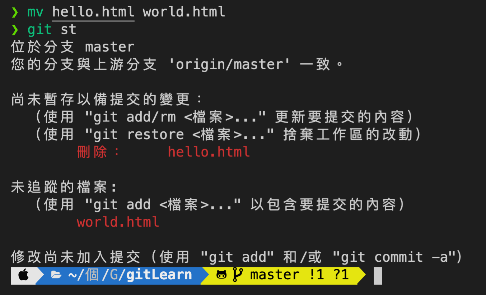
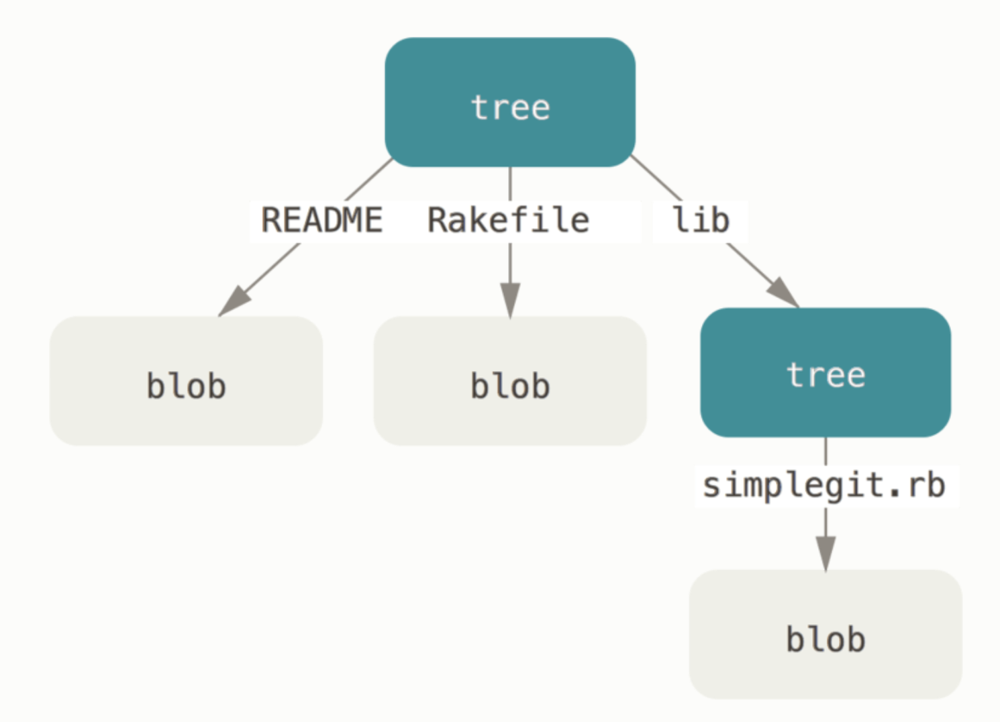
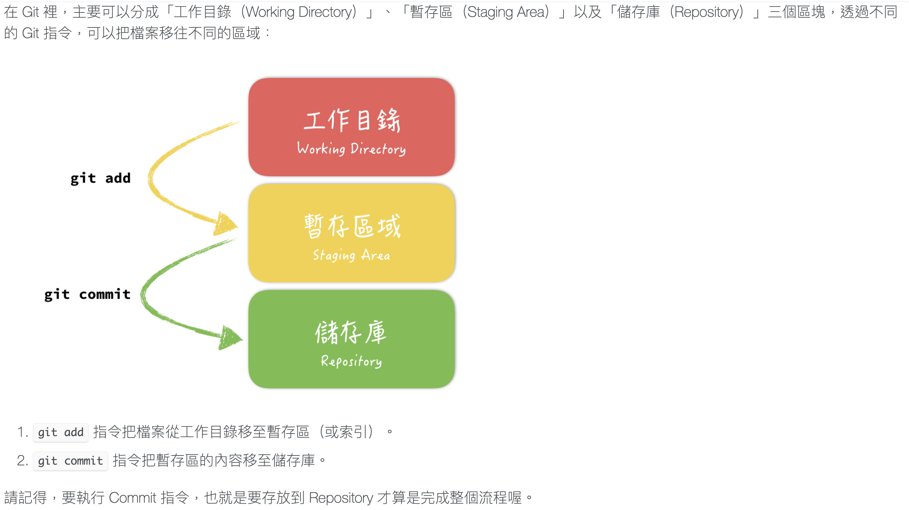
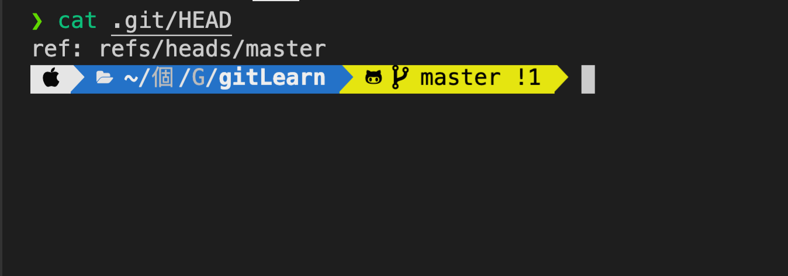
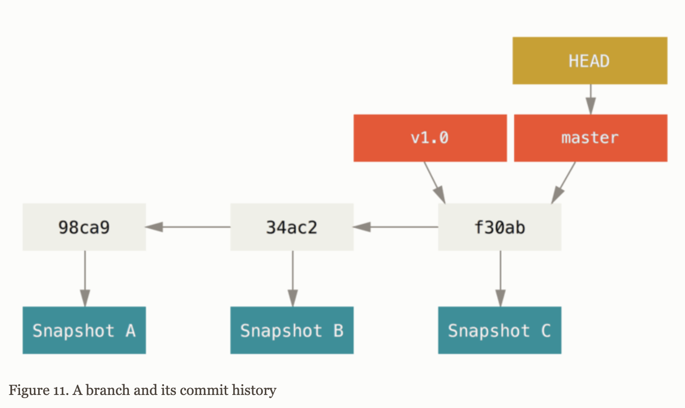
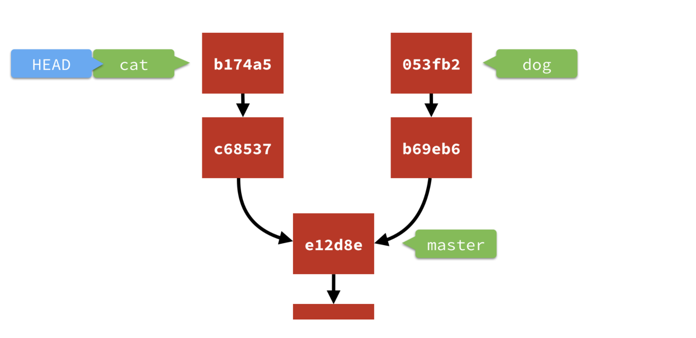
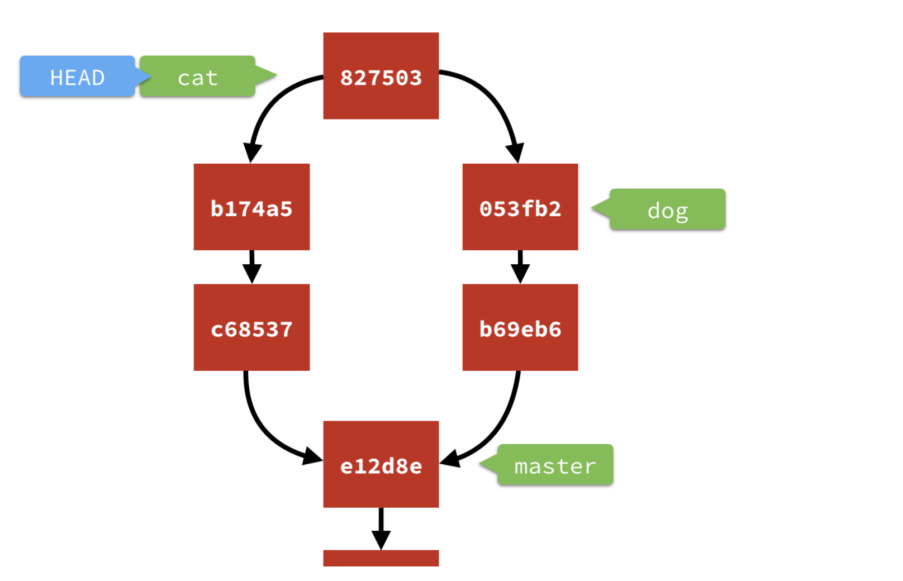

Git Learn  
自主學習Git的觀念和指令後做的統整&學習筆記
===

## 目錄
- [自主學習Git的觀念和指令後做的統整&學習筆記](#自主學習git的觀念和指令後做的統整學習筆記)
  - [目錄](#目錄)
    - [安裝方式](#安裝方式)
      - [Windows系統](#windows系統)
      - [MacOS系統](#macos系統)
      - [Linux系統](#linux系統)
    - [設定Git](#設定git)
    - [Git 基礎常用指令](#git-基礎常用指令)
      - [初始化該目錄,主要目的是讓Git開始對這個目錄進行版本控制](#初始化該目錄主要目的是讓git開始對這個目錄進行版本控制)
      - [把這個檔案交給Git來控管](#把這個檔案交給git來控管)
      - [把暫存區(staging area)的檔案提交到倉庫存檔](#把暫存區staging-area的檔案提交到倉庫存檔)
      - [想檢視Git紀錄](#想檢視git紀錄)
      - [刪除Git檔案](#刪除git檔案)
      - [變更檔名](#變更檔名)
      - [修改Commit紀錄](#修改commit紀錄)
      - [如果有特定檔案不想放在Git裡面一起備份或是上傳到Git Server的話,例如:資料庫密碼,雲端伺服器的金鑰...可以加入 `.gitignore`中](#如果有特定檔案不想放在git裡面一起備份或是上傳到git-server的話例如資料庫密碼雲端伺服器的金鑰可以加入-gitignore中)
      - [檢視特定檔案的commit紀錄](#檢視特定檔案的commit紀錄)
      - [想要知道某個檔案的某一行是誰寫的](#想要知道某個檔案的某一行是誰寫的)
      - [在工作目錄(working directory)想要復原不小心透過 `rm` 指令刪除的檔案](#在工作目錄working-directory想要復原不小心透過-rm-指令刪除的檔案)
      - [如果想重新編輯剛才的commit](#如果想重新編輯剛才的commit)
      - [新增`Tag物件`到`Commmit物件`](#新增tag物件到commmit物件)
      - [分支(branch)操作](#分支branch操作)
    - [觀念介紹](#觀念介紹)
      - [Git 其實是一種分散式的版本控制系統](#git-其實是一種分散式的版本控制系統)
      - [Git 的優點](#git-的優點)
      - [Git 是用快照(snapshot)在做版本控制的](#git-是用快照snapshot在做版本控制的)
      - [Git 的四大物件(`Blob`,`Tree`,`Commit`,`Tag`)觀念介紹](#git-的四大物件blobtreecommittag觀念介紹)
      - [$ `git count-objects`: 可以檢視目前有多少物件和用掉多少儲存空間](#-git-count-objects-可以檢視目前有多少物件和用掉多少儲存空間)
      - [在使用Git時,指令要在正確的目錄下才能正常運作](#在使用git時指令要在正確的目錄下才能正常運作)
      - [在Git術語中,暫存區(staging area)=索引(index)](#在git術語中暫存區staging-area索引index)
      - [Git 世界裡的的三大區域---`工作目錄(working directory)`,`暫存區(staging area)`,`儲存庫(repository)`](#git-世界裡的的三大區域---工作目錄working-directory暫存區staging-area儲存庫repository)
      - [為什麼每次都要先$ `git add` 再 $ `git commit`](#為什麼每次都要先-git-add-再--git-commit)
      - [Git物件的id是怎麼計算出來的? (`SHA-1演算法`)](#git物件的id是怎麼計算出來的-sha-1演算法)
      - [`HEAD`是什麼?](#head是什麼)
      - [`ORIG_HEAD`是什麼?](#orig_head是什麼)
      - [`分支(branch)`是什麼?](#分支branch是什麼)
      - [`Detached HEAD` (斷頭) 是什麼?](#detached-head-斷頭-是什麼)
    - [觀念釐清](#觀念釐清)
      - [Git無法控管 `空目錄/`](#git無法控管-空目錄)
      - [$ `git rm --cached` V.S. `.gitignore` 比較](#-git-rm---cached-vs-gitignore-比較)
      - [在專案中的整個`.git/` 目錄是Git版控的核心檔案](#在專案中的整個git-目錄是git版控的核心檔案)
      - [$ `git reset` 是用來"前往"到指定的`Commit物件`上的](#-git-reset-是用來前往到指定的commit物件上的)
      - [Git四大物件(`Blob`,`Tree`,`Commit`,`Tag`)彼此之間其實是平行關係](#git四大物件blobtreecommittag彼此之間其實是平行關係)
      - [Git其實不是在做差異備份,而是在為當時的專案建立快照(snapshot)](#git其實不是在做差異備份而是在為當時的專案建立快照snapshot)
      - [把`cat分支`合併到`dog分支`&把`dog分支`合併到`cat分支`有什麼不同呢?](#把cat分支合併到dog分支把dog分支合併到cat分支有什麼不同呢)
      - [合併分支其實不是真的在合併分支!](#合併分支其實不是真的在合併分支)
    - [實戰情境題](#實戰情境題)
      - [如果在git add之後又修改了那個檔案的內容呢?](#如果在git-add之後又修改了那個檔案的內容呢)
      - [如果不小心使用$ `git reset --hard` 模式,能救回來嗎?](#如果不小心使用-git-reset---hard-模式能救回來嗎)
      - [如果這次只想commit一個檔案中的部份內容的話,該怎麼做呢?](#如果這次只想commit一個檔案中的部份內容的話該怎麼做呢)
      - [如果修改專案的某些檔案到一半,卻不小心先切換到別的分支(branch),該怎麼辦?](#如果修改專案的某些檔案到一半卻不小心先切換到別的分支branch該怎麼辦)
      - [如果不小心把還沒合併的分支刪掉了,該怎麼挽救?](#如果不小心把還沒合併的分支刪掉了該怎麼挽救)
      - [如果想從過去的某次`commit紀錄`再長一個`新的分支(branch)`出來,該如何做呢?](#如果想從過去的某次commit紀錄再長一個新的分支branch出來該如何做呢)
      - [當兩個分支都編輯了同一個檔案(`both modified 狀態`),造成`合併分支時發生衝突`了,該怎麼解決呢?](#當兩個分支都編輯了同一個檔案both-modified-狀態造成合併分支時發生衝突了該怎麼解決呢)
    - [觀念補充](#觀念補充)
      - [終端機(Terminal)是什麼?](#終端機terminal是什麼)
      - [Vim 是Git的預設編輯器,Vim主要常用的兩種模式](#vim-是git的預設編輯器vim主要常用的兩種模式)
      - [SHA-1(安全散列演算法) 介紹](#sha-1安全散列演算法-介紹)
  
  
---
### 安裝方式
#### Windows系統
  + 連結: https://git-scm.com/download/win
  + 安裝完後,使用Git Bash就可以操作Git了
  + $ `which git`    // /mingw/bin/git
  + $ `git --version`   // git version 2.28.0.windows.1
  + GUI client推薦: SourceTree, GitHub Desktop
    * 下載連結: https://git-scm.com/downloads/guis
  + 補充: Git Bash不同於Windows內建的"命令提示字元",它本身模擬了Linux的 Bash
#### MacOS系統
  + 連結: https://git-scm.com/download/mac
  + 或是利用Homebrew安裝
  + $ `brew install git`
  + 補充: Homebrew是一個MacOS專屬的套件管理包工具,有點像是Linux的apt-get之類的安裝工具,通常只要一行指令就可以完成下載.編譯.安裝
  + GUI client推薦: SourceTree, GitHub Desktop
    * 下載連結: https://git-scm.com/downloads/guis
#### Linux系統
  + 連結: https://git-scm.com/download/linux
  + 利用apt-get安裝
  + $ `sudo apt-get install git`    // 在Linux系統中要安裝軟體要先切換成root權限
  + GUI client推薦: gitk
    * $ `sudo apt-get install gitk `

---
### 設定Git
> `git config` - Get and set repository or global options 
> `git log` - Show commit logs
- 所有Git相關的設定都會儲存在 `~/.gitconfig` 這個檔案裡
- 設定使用者的Email＆username
  + $ `git config --global user.name "Hans-Tsai"`
  + $ `git config --global user.email "lgs840522@gmail.com"`
- 檢視目前的設定
  + $ `cat ~/.gitconfig`
  + $ `git config --list`
- 設定Git要使用的編輯器(預設是使用Vim)
  + $ `git config --global core.editor emacs`
- 設定Git客製化縮寫指令
  + $ `git config --global alias.co checkout`  
  + $ `git config --global alias.br branch`
  + $ `git config --global alias.st status`
  + $ `git config --global alias.ls 'log --graph --pretty=format:"%h <%an> %ar %s"'`

---
### Git 基礎常用指令
> `git init` - Create an empty Git repository or reinitialize an existing one 
> `git status` - Show the working tree status 
> `git add` - Add file contents to the index 
> `git commit` - Record changes to the repository 
> `git log` - Show commit logs 
> `git rm` - Remove files from the working tree and from the index 
> `git mv` - Move or rename a file, a directory, or a symlink 
> `gitignore` - Specifies intentionally untracked files to ignore 
> `git clean` - Remove untracked files from the working tree 
> `git blame` - Show what revision and author last modified each line of a file 
> `git checkout` - Switch branches or restore working tree files 
> `git switch` - Switch branches 
> `git restore` - Restore working tree files 
> `git reset` - Reset current HEAD to the specified state 
> `git reflog` - Manage reflog information 
> `git tag` - Create, list, delete or verify a tag object signed with GPG 
> `git merge` - Join two or more development histories together 
> `git rebase` - Reapply commits on top of another base tip 

#### 初始化該目錄,主要目的是讓Git開始對這個目錄進行版本控制
  + $ `git init`
  + 會在該目錄裡面建立一個 `.git/` 隱藏檔目錄,整個Git的精華都會在這個目錄裡面
- 如果該目錄不想再被Git做版本控制,只要將`.git/`目錄整個刪除就可以 
  + $ `rm -rf .git/` 
  + 注意:整個專案目錄裡,什麼檔案或目錄刪了都救得回來,但 `.git/` 目錄只要刪了就沒辦法了 !
- 查詢現在這個目錄的"狀態"
  + $ `git status`
  + Untracked files => 代表這個檔案尚未被加到Git版控系統裡,還沒開始正式被"追蹤",它只是剛剛才加入到這個目錄裡而已
  + 
#### 把這個檔案交給Git來控管
  + $ `git add welcome.html`
  + 剛才的檔案 `welcome.html`從Untracked變成new file狀態 => 表示這個檔案已經被安置到暫存區(Staging Area),等待稍後跟其他檔案一起被存到儲存庫裡面
  + 
  + 如果想將全部檔案一口氣加入暫存區,可以使用--all參數;不論檔案狀態是Untracked files或是Changes not staged for commit,都會一口氣變成Changes to committed
    * $ `git add --all` or $ `git add -A` 
    * $ `git add .` =>會將整個專案裡的全部異動檔案加到暫存區,不受限這個指令在哪一層目錄執行
    * $ `git add --all`=>只會把當前執行command的那個目錄以及它的子目錄的異動檔案加到暫存區,所以在哪一層目錄執行這個command很重要
#### 把暫存區(staging area)的檔案提交到倉庫存檔
  + $ `git commit -m "git commit練習"`
  + -m = (--messge)參數:代表在這次commit做了什麼事情的說明字串,中英文皆可,言簡意賅就好; $ `git commit`預設-m參數是必填的
  + 
  + 可以不用二段式commit,也可以用$ `git commit -a -m "update content"`來達到$ `git add` + $ `git commit -m`
  + Git每次commit都只會處理暫存區(staging area)裡的內容,也就是說,如果在執行 $ `git commit` 之前還沒被加到暫存區裡的檔案,就不會被commit到儲存庫了
  + 提醒:要完成commit才算是完成整個流程喔!
#### 想檢視Git紀錄
  + 使用$ `git log`指令,越新的資訊會在越上面,並會得到以下三個資訊
  + Commit作者是誰? => 人是誰殺的?
  + 什麼時候commit的? => 什麼時候殺的?
  + 每次的commit大概做了哪些事? => 怎麼殺的?
  + 
  + 也可以使用參數將$ `git log`輸出成不同的形式
    * $ `git log --oneline --graph` 
    * `--oneline`:每個commit物件僅顯示成一行
    * `--graph`:用圖表來表示commit物件之間的線性關係
    * 
  + 可以透過$ `git log`尋找特定author的commit物件
    * $ `git log --oneline --author="Hans"`
    * 作者(author)是最初修改的人
    * 提交者(committer)是最後套用該工作成果的人
  + 可以透過$ `git log`尋找符合特定字串的commit"訊息(-m)"
    * $ `git log --oneline --grep="initial"`
  + 可以透過$ `git log`搜尋在所有commit物件中,有哪些符合特定條件的
    * $ `git log -S "Ruby"`
  + 可以透過$ `git log`搭配參數來查詢特定時間內的commit物件
    * $ `git log --oneline --since "9am" --until "12am" --after="2017-01"`
    * `--since`:"hham/pm"
    * `--until`:"hham/pm"
    * `--after`:"yyyy-mm"
#### 刪除Git檔案
  + 刪除檔案對Git來說都是一種"修改" 
  + 可以透過系統指令刪除檔案$ `rm welcome.html`
    * 這時候的檔案會是deleted狀態
    * 
    * 還需要再執行$ `git add xxx.txt` 才會將這個"刪除"加到暫存區
  + 可以透過$ `git rm welcome.html`
    * $ `git rm` = `rm xxx.txt` + `git add xxx.txt`
    * $ `git rm` 相當於先$ `rm`刪除檔案後再$ `git add` 加入暫存區的兩段式動作
    * 
    * 不管是系統指令的$ `rm`或是$ `git rm`都真的會把檔案從工作目錄刪掉,但如果只是不想讓檔案再被Git控管,可以加上`--cached`參數
    * $ `git rm xxx.html --cached`
    * `--cached`:不會真的將檔案刪除掉,僅將檔案脫離Git控管,成為Untracked file
#### 變更檔名
  + 跟"刪除"檔案一樣,變更檔名也是一種"修改"
  + 
  + 雖然只是透過系統指令$ `rm` 來改名,但對Git來說會被認為是兩個動作,後續仍須使用$ `git add world.html`指令來把這些異動加入暫存區
    * 刪除~~hello.html~~檔案
    * 新增world.html檔案(變成Untracked file)
  + 可以透過$ `git mv world.html hans_world.html`
    * $ `git mv` = `mv 新檔名.html` + `git add 新檔名.html`
    * $ `git mv` 相當於先$ `mv`修改檔名後再$ `git add` 加入暫存區的兩段式動作
    * 
    * 這樣`hans_world.html`就會直接變成`renamed file`
  + 其實Git是根據檔案的"內容"去算出SHA-1的值,所以Git不是很在乎你的檔案叫什麼名稱,只在乎檔案的內容是什麼。所以當進行更改檔名的時候,Git並沒有為此做出一個新的Blob物件,而僅是指向原來舊的那顆Blob物件;但因為檔案名稱改變了,所以會做出一顆新的Tree物件喔!
#### 修改Commit紀錄
  + 想修改commit紀錄有以下4種方法
    * 把`.git/`目錄整個刪除 -> 不建議,等於砍掉重練
    * 使用$ `git rebase` 來修改歷史
    * 先把commit用$ `git reset`拆掉,整理後再重新commit
    * 使用`git commit --amend`參數來修改最後一次的commit物件 -> 較推薦此作法!
  + 可以透過$ `git commit --amend -m "新的commit message"`來修改commit紀錄
    * `--amend`:只能修改"最近一次"的commit紀錄
    * 
  + 如果在完成commit後,卻發現有一個檔案忘了加到這次的commit中,但不想因為這個檔案再重新發送一次commit,想把這個檔案加入最近一次commit,此時有兩個做法
    * 使用$ `git reset` 把最後一次的commit拆掉,加入新檔案後再重新commit
    * 使用`--amend`參數進行commit
      * $ 先 `git add pizza.html`,將Untracked file 加入追蹤
      * $ 再 `git commit --amend --no-edit`,把這個檔案併入最後一次的commit中,而後面的`--no-edit`參數就是不要開啟vim編輯視窗來編輯commit message的意思
      * 
  + 提醒:即便"只是修改commit message",仍然會產生新的commit id,因為這樣對Git來說commit物件的內容是有"變動"的,所以Git會重新計算並產生一顆新的Commit物件,也就是說這其實算是一次全新的commit
  + 如果想修改更早的commit紀錄,就必須使用$ `git rebase` 指令了
  + 團隊開發守則:即便只是修改commit message,不管如何它就是修改了一次歷史,所以請盡量"不要"在已經`push`出去之後再修改,否則可能會造成其他人的困擾
#### 如果有特定檔案不想放在Git裡面一起備份或是上傳到Git Server的話,例如:資料庫密碼,雲端伺服器的金鑰...可以加入 `.gitignore`中
  + 可以在專案中建立一個 `.gitignore` 的檔案,裡面可以設定想要忽略的規則
  + `.gitignore`只要一被建立並符合規則就會生效,即使這個檔案還沒被commit或是還沒被push到Git Server,這要一來整個專案的人都可以共享這個"忽略規則"的設定
  + 想查詢在使⽤的⼯具或程式語⾔通常會忽略哪些檔案,可以到GitHub上有整理了⼀份各種程式語⾔常⾒的 `.gitignore` 檔案
    * github/gitignore repository連結:<https://github.com/github/gitignore>
  + 可以利用`-f`參數,來無視 `.gitignore`的忽略,強制將檔案加入Git追蹤範圍中
    * $ `git add -f xxx.tmp`
    * 
    * 提醒: `.gitignore` 檔案設定的規則,只對"在規則設定之後"的檔案有效
  + 想一次將被 `.gitignore` 忽略的檔案們一次刪除,可以使用$ `git clean`來完成
    * $ `git clean` 可以將工作目錄(working directory)中的所有Untracked files都一次刪除
    * $ `git clean -fX`
      * -f: 強制執行
      * -X: 只移除被Git忽略的檔案(有在.gitignore中提到的)
#### 檢視特定檔案的commit紀錄
  + $ `git log -p xxx.html`
    * -p: 可以更詳細的檢視每一次的commit到底做了哪些修改
    * 補充: 前面的"+"是新增,"-"是刪除
    * 
#### 想要知道某個檔案的某一行是誰寫的
  + $ `git blame xxx.html`
  + 可以詳細地看出來每一行是誰在什麼時候寫的
  + 每一行前面的SHA-1值就是每一個Commit物件的識別代碼
  + 
  + $ `git blame -L xxx.html`
    * -L <start>,<end>: 可以只顯示指定行數的內容
#### 在工作目錄(working directory)想要復原不小心透過 `rm` 指令刪除的檔案
  + $ `git checkout`可以用來 (在Git `Version 2.23.0` 之後)
    * 切換分支(= $ `git switch`)
    * 恢復工作目錄(working directory)裡的文件(= $ `git restore`)
    * 當$ `git checkout "分支名稱"` 時,就會切換到指定的分支
      * 例如:$ `git checkout -b tiger`: 切換到`tiger`分支,如果沒有該分支的話,就新增一個`tiger`分支
        * `-b <新的分支名稱>`: (=> `branch`): 切換到`<新的分支名稱>`,如果沒有的話,就新增一個`<該分支>`
    * 當$ `git checkout "檔案名稱 or 路徑"` 時,Git就會到 `.git/` 目錄裡拉一份到目前的工作目錄(working directory)
  + $ `git checkout xxx.html` 可以將工作目錄(working directory)中不小心刪除(`rm`)掉的指定檔案復原回來
  + 例如: `pizza.html` 從deleted status變回原本的狀態
  + 也可以利用 $ `git checkout .` 一口氣把所有工作目錄(working directory)中被刪掉的檔案救回來
  + 
  + $ `git checkout HEAD~2 yyy.html`
    * 這樣就會到 `.git/` 裡拿距離現在兩個版本以前的 yyy.html 來覆蓋現在工作目錄(working directory)的 yyy.html ,但要注意的是,這同時也會更新暫存區(staging area)的狀態喔 
  + 以此類推, $ `git checkout HEAD~2`
    * 這樣就會拿距離現在兩個版本以前的檔案來覆蓋現在工作目錄(working directory)裡的檔案,同時也更新暫存區(staging area)裡的狀態
#### 如果想重新編輯剛才的commit
  + $ `git log --oneline` 顯示的歷史commit紀錄是由新到舊(上到下)
    * 
  + 利用 $ `git reset f06546a` 來回溯到過去指定的Commit物件中
    * 可以使用"相對"或是"絕對"的表示方式
      * `^` : 前一次
      * `~次數` : 要倒退至幾次commit以前
      * `SHA-1值`: 絕對的表示方式
      * 所以$ `git reset f06546a^^` = $ `git reset f06546a~2`
    * 例如: $ `git reset f06546a^ ` =>代表回到該commit的前一次commit紀錄中
    * 例如: $ `git reset master^ ` =>代表回到master分支的前一次commit紀錄中
    * 例如: $ `git reset HEAD^ ` =>代表回到HEAD目前指向的分支(該分支指向的commit)的前一次commit紀錄中
  + $ `git reset <模式>` ,有三種模式可以選擇,預設為 `mixed`模式
    * `mixed` 模式: 這模式下的`reset`會把暫存區(staging area)的檔案丟掉,但不會動到工作目錄(working directory)的檔案,也就是說commit拆出來的檔案會留在工作目錄,但不會留在暫存區
    * `soft` 模式: 這模式下的`reset`,工作目錄(working directory)和暫存區(staging area)的檔案都不會被丟掉,因此看起來就只有`HEAD`在移動而已; 所以commit拆出來的檔案都會直接被存放在暫存區
    * `hard` 模式: 這模式下的`reset`,不管是暫存區(staging area)和工作目錄(working directory)都會被丟掉
    * 小統整:  
             參考圖片出處<https://gitbook.tw/>
      * `mixed` 模式=> `index移除staged標記`,變成Modified或是Untracked file,內容是新版的
      * `soft` 模式=> `僅移除commit變成新版"未"commit`,內容仍是新版的
      * `hard` 模式=> 回到上一版本,`這期間的所有變更完全移除`,內容及狀態皆是上一版
#### 新增`Tag物件`到`Commmit物件`
  + $ `git tag -a wow -m "Tag物件-annotated tag 練習"`
    * $ `git cat-file -t <`Tag物件`的SHA-1值>`
    * 
  + 統整: `Tag物件`中的有附註Tag(Annotated Tag)會指向某個`Commit物件`
#### 分支(branch)操作
  + [分支基礎操作可參考](`分支(branch)`是什麼?)
  + 合併分支的兩種方式($ `git merge` & $ `git rebase`)
    * 方法一 : $ `git merge`
    * $ `git merge <要合併到的分支名稱>`: 可以用來將目前所在的分支(branch)合併到 `<要合併到的分支名稱>`
      * 若要合併掉別人的分支是從要被合併掉的分支的開出來的,若要被合併掉的分支沒有修改的話,Git會預設使用快轉模式(fast-forward)來做合併 
        * $ `git merge --ff <要合併到的分支名稱>`
          * `--ff` (=> 此為Git預設`fast-forward`模式)
        *  
          參考圖片出處: <https://backlog.com/git-tutorial/tw/stepup/stepup1_4.html>
      * 但若原本的那個分支有修改過的話,這時候Git就不會使用快轉模式(`fast-forward`),此時Git會額外再做出一個新的`Commit物件`來合併這兩個分支
        * $ `git merge --no-ff <要合併到的分支名稱>`
          * `--no-ff` (=> 強制"不要"使用fast-forward模式)
          *  
            參考圖片出處: <https://backlog.com/git-tutorial/tw/stepup/stepup1_4.html>
      * $ `git merge --ff-only <要合併到的分支名稱>`
        * `--ff-only` (=> 盡可能的優先使用fast-forward模式合併,此時如果無法做到使用fast-forward模式合併的話,Git就會拒絕這次的指令並回傳一個"失敗"的錯誤狀態) 
    * `情境說明`(要用`master分支`來合併`pig分支`)
    * 先新增一個分支(branch): `pig`
    * 建立一個新的檔案,並commit: `pig.html`
    * 新增一行文字後,再commit一次: `hello, pig`
    * $ `git log`: 檢視一下目前的commit歷史紀錄(確認目前是在`pig分支`並且有`兩次commit的紀錄`)
    * 
    * 要先切回`master分支`
      * $ `git checkout master`
    * $ `git merge pig`: 將`pig分支`合併回到`master分支`
      * 本來落後`pig分支`兩次commit紀錄的`master分支`,現在也已經跟上`pig分支`的進度了 
      * 
    
    * 方法二 : $ `git rebase`
    * $ `git rebase <要被rebase的分支名稱>`
      * 可以重新定義`分支(branch)`參考的基準
      * 可以用來將目前所在的分支(branch)合併到 `<要被rebase的分支名稱>`
      *  
        參考圖片出處: <https://dev.to/lydiahallie/cs-visualized-useful-git-commands-37p1?fbclid=IwAR22RpLWxsCk1qKLdJynK4BCMyD5FSTvRHta8GvAyJO2ALi4WObsdQ-UWNU>
      * `情境說明`
      * 從`master`分支拆分出兩個分支(`elephant`,`zebra`),並分別各commit兩次
      * 
      * 記得要先切換到`elephant分支`(要rebase到別人的分支)!
        * $ `git checkout elephant` 
      * $ `git rebase zebra`: 將`elephant分支`rebase到`zebra分支`上面
      * 
    * $ `git rebase -i <HEAD的相對位置>`
      * 例如: $ `git rebase -i HEAD~3`
      * 可以先在互動式模式編輯哪些`Commit物件`要被`Rebase`
        * 可以使用像是`pick`、`edit`、`squash`、`drop` 等相關Git指令來編輯這些`Commit物件` 
      * `-i` (=> `--interactive`): 利用互動式模式來"預先"編輯要`被rebased的那些Commit物件`
      *  
        參考圖片出處: <https://dev.to/lydiahallie/cs-visualized-useful-git-commands-37p1?fbclid=IwAR22RpLWxsCk1qKLdJynK4BCMyD5FSTvRHta8GvAyJO2ALi4WObsdQ-UWNU>
      *  
        參考圖片出處: <https://dev.to/lydiahallie/cs-visualized-useful-git-commands-37p1?fbclid=IwAR22RpLWxsCk1qKLdJynK4BCMyD5FSTvRHta8GvAyJO2ALi4WObsdQ-UWNU>
    * $ `git rebase` 是一種會修改到歷史紀錄的指令,盡量不要隨便對已經推出去給別人內容進行`rebase`,這樣很容易造成其他人的困擾
    * 用$ `git rebase` 的方式合併分支 & 用$ `git merge` 的方式合併分支,有一個很明顯的差別是用`Rebase方式`合併分支的話,Git並不會特別做出一個專門用來合併分支的`Commit物件`
    * $ `git rebase` 的原理其實是做多次"Apply"到`新的基準點branch`指向的`Commit物件`上
      *  
        參考圖片出處: <https://gitbook.tw/chapters/branch/merge-with-rebase.html>
    * 用`Rebase合併分支`過後,原來舊的那個分支原本所用到的那些Commit物件,並"不會立即被Git刪除"; 只是因為那些`Commit物件`沒有`分支(branch)`指向他們,所以如果我們也沒特別去記下這些`Commit物件的id`的話,這些`Commit物件`就會慢慢地被邊緣化,直到有一天被Git的內建資源回收機制帶走
    * 其實誰Rebase誰以結果來看是沒什麼差別的,但以歷史紀錄來說的話,被rebase的分支會寫在後面
    * 想取消合併分支的話,有以下兩種方式
      * 如果是用 $ `git merge` 來合併分支的話: 用 $ `git reset HEAD~2 --hard` => 也就是拆掉這個合併的Commit物件,大家就會退回到合併前的狀態
      * 如果是用 $ `git rebase` 來合併分支的話,因為這個方法Git並不會特別做出一個`Commit物件`來合併分支,所以不能用上述的方法;但可以用以下兩種方式來取消合併分支
        * 先檢視目前的`Reflog紀錄`
          * $ `git reflog`
            * 
            * 找出對應到最久以前的 `rebase關鍵字`的前一次`Commit物件`的id
            * 以這個例子是: `ce76004`這個`Commit物件id`
          * 用 $ `git reset <要回到過去的哪個Commit物件id> --hard`
          * 這樣就可以回到`Rebase`以前的狀態了
        * 先檢視目前的`ORIG_HEAD`指向的`Commit物件的id`
          * 可先參考[`ORIG_HEAD`是什麼?](#orig_head是什麼)
          * $ `cat .git/ORIG_HEAD`: `回傳Git危險操作以前的`ORIG_HEAD`指向的`Commit物件`的id
          * 
  + 使用`Rebase`方式來合併分支的優缺點分析
    * 好處1: 不會特別產生一個為了合併分支的`Commit物件`
    * 好處2: 合併的歷史順序可以自由決定(依照`誰Rebase誰`而定)
    * 缺點1: 相對來說,比起`Merge`方式來合併分支,並沒有那麼直覺
    * 缺點2: 如果一個不小心可能會弄壞掉而且還不知道該怎麼`Reset`回來
    * 建議: 可以在還沒推出去前(`Push`),如果覺得`Commit物件`們太凌亂or瑣碎,可以先用`Rebase合併分支的方式`來整理這些`Commit物件`,再推出去
    * 提醒: `Rebase`等於是修改歷史紀錄,如果修改已經推出去(`Push`)的歷史紀錄可能會造成其他人的困擾,所以如果是已經推出去(`Push`)的內容,非必要盡量不要使用`Rebase`

---
### 觀念介紹
> `The HEAD`: HEAD is the pointer to the current branch reference, which is in turn a pointer to the last commit made on that branch. That means HEAD will be the parent of the next commit that is created. It’s generally simplest to think of HEAD as the snapshot of your last commit on that branch. 
> `ORIG_HEAD`: Git在危險操作以前,會先自動記錄當下`HEAD`指向的`Commit物件的id` 
> `git branch` - List, create, or delete branches 
> `git cat-file` - Provide content or type and size information for repository object 
> `git count-objects` - Count unpacked number of objects and their disk consumption 

#### Git 其實是一種分散式的版本控制系統
- Git是一種分散式的版本控制系統,而所謂的"版本控制系統"就是指會幫你記錄所有的狀態變化,隨時可以切換到過去某個版本的狀態

#### Git 的優點
- Git的優點
  + 免費.開源
  + Git是記錄檔案內容的快照(snapshot),而不是記錄版本之間的差異,它可以讓Git更快速地切換版本
  + Git是一款分散式的版控系統(Distributed Version Control),雖然也會有共同的伺服器,但即使在沒有伺服器或是沒有網路的環境,依舊可以使用Git來進行版控,待伺服器恢復正常運作或是在有網路的環境後再同步,不會受影響
  + 註: Git和SVN相比,最大的不同點就是,Git可以在local端做一些修改,然後commit到本地的版本庫,最後push到伺服器; 而SVN只要一commit,更改就已經提交到伺服器了

#### Git 是用快照(snapshot)在做版本控制的
- Git在每次版本變化的時候,有點像拍照(snapshot)一樣,Git會更新並記錄整個目錄跟檔案的樹狀結構

#### Git 的四大物件(`Blob`,`Tree`,`Commit`,`Tag`)觀念介紹
- Git的四大物件結構: 在`.git/` 的資料結構裡面會有
  + Blob物件
    * `情境說明` 
    * 當檔案被加入暫存區(staging area)時,Git便會在`.git/`目錄裡產生一個`Blob`(Binary large object)物件,並且依照它的"規則"擺放到它的目錄裡,這個`Blob物件`是用來存放該檔案的"內容"
    * 接下來,就會到 `.git/objects/`目錄裡存放該檔案,Git會用`SHA-1`的40個字中的`前2個字`作為目錄,剩餘的38個就是檔案名稱
    * 
    * 透過$ `git cat-file`來檢視Git repository內各物件的 `值` or `型態` or `大小` or `相關詳細資訊`
      * -t: 顯示該物件的型態(type)
      * -p: 顯示該物件的內容(content)
      * -s: 顯示該物件的大小(size)
      * 
    * 統整: 
      * 步驟一: 當使用$ `git add`把檔案加入至暫存區時,Git會根據這個物件的"內容"計算出`SHA-1`值
      * 步驟二: Git接著會用這個`SHA-1`值的前`2`個字當作`目錄名稱`,後38個字當作檔案名稱;接著Git會把目錄及檔案建立在`.git/objects/` 目錄裡面
      * 步驟三: 該檔案的內容則是Git使用壓縮演算法,把原本的"內容"壓縮之後的結果
    * 補充: `Blob物件`的`檔名`是由`SHA-1`演算法決定的,Blob物件的`內容`則是壓縮演算法決定的
  + Tree物件
    * `Tree物件`會指向`某個`或是`某些Blob物件`,或是其他`Tree物件`
    *  
      參考圖片出處: <https://git-scm.com/book/zh-tw/v2/Git-Internals-Git-Objects> 
    * 
    * 統整:
      * 步驟一: `檔案`在Git裡會以`Blob物件`的方式存放
      * 步驟二: `目錄`及檔案名稱會以`Tree物件`的形式存放
      * 步驟三: `Tree物件`會指向`某個`或是`某些Blob物件`,或是其他`Tree物件`
  + Commit物件
    * 通常包含以下 4 項資訊 
      * 某個`Tree物件`
      * parent: 會指向前一次的Commit物件
      * 作者跟這次commit的人&該次的commit時間
      * 本次的commit訊息($ `git commit -m`)
    *  
      參考圖片出處: <https://git-scm.com/book/en/v2/Git-Internals-Git-Objects>
    * 統整`Commit物件`的規則:
      * `Commit物件`會指向某個`Tree物件`
      * `Tree物件`會指向`某個`或是`某些Blob物件`,或是其他`Tree物件`
      * 除了第一個`Commit物件`以外,所有的`Commit物件`都會指向它的前一次的`Commit物件`
  + Tag物件
    * $ `git tag -a wow -m "Tag物件 annotated tag 練習"`
    * $ `git cat-file -t <`Tag物件`的SHA-1值>`
    * 
    * 統整:
      * `Tag物件`中的有附註Tag(Annotated Tag)會指向某個`Commit物件`
  + Git四大物件(`Blob`,`Tree`,`Commit`,`Tag`)觀念整合:
    * 把檔案加入Git之後,檔案的內容會被轉成`Blob物件`儲存
    * 目錄以及檔名會存放在`Tree物件`內,`Tree物件`會指向`Blob物件`,或是其它的`Tree物件`
    * `Commit物件`會指向某個`Tree物件`;除了第一個`Commit物件`以外,其它的commit都會指向前一次的`Commit物件`
    * `Tag物件`(Annotated Tag)會指向某個`Commit物件`
    * `分支`(branch)雖然不屬於四個物件之一,但它會指向某個`Commit物件`
    * 當開始往Git Server上推送之後,在 `.git/refs/` 底下就會多出一個 `remote/目錄`,裡面放的是遠端的分支,基本上跟本地的分支是差不多的概念,同樣也會指向某個`Commit物件`
      *  
    * `HEAD`也不屬於Git四大物件之一,它會指向某個`分支`(branch)

#### $ `git count-objects`: 可以檢視目前有多少物件和用掉多少儲存空間
- $ `git count-objects`: 可以檢視目前有多少物件和用掉多少儲存空間
  + 
  + `-v` (=> `--verbose`): 顯示這個Git管控的專案中所有物件的更多詳細資訊
  + `-H` (=> `--human-readable`): 將所有在這個Git管控的專案中所有物件所佔用的儲存空間用人類可閱讀的格式來顯示(MB)

#### 在使用Git時,指令要在正確的目錄下才能正常運作
- 在使用Git時,指令要在正確的目錄下才能正常運作

#### 在Git術語中,暫存區(staging area)=索引(index)
- 暫存區(Staging Area)又可稱為索引(index)

#### Git 世界裡的的三大區域---`工作目錄(working directory)`,`暫存區(staging area)`,`儲存庫(repository)`
- 在Git裡,主要可以分成三個區域,透過不同的git指令可以把檔案移動往不同的區域
  + 工作目錄(Working Directory)
  + 暫存區域(Staging Area) or (index)
  + 儲存庫(Repository)
  +  
    參考圖片出處<https://gitbook.tw/>

#### 為什麼每次都要先$ `git add` 再 $ `git commit`
- 可以想像你有一個倉庫,倉庫門口有個小廣場,這個廣場的概念就像跟暫存區一樣,你把要存放到倉庫的貨物先放到這邊($ `git add`),然後等收集的差不多了就可以打開倉庫門,把放在廣場上的貨物送進倉庫裡($ `git commit -m`,並記錄下來這批貨是什麼用途的? & 誰送來的?)

#### Git物件的id是怎麼計算出來的? (`SHA-1演算法`)
- 在Git的Commit物件裡每串看起來像亂碼的文字,都是透過SHA-1演算法計算出來的結果,是一種重複率極低的演算法;Git使用這樣的字串作為識別,每個Commit物件都有一個這樣的值,你可以把它想像成是每個Commit物件的身分證字號,不會重複

#### `HEAD`是什麼?
- `HEAD` 是一個指標,會指向某一個分支,我們通常可以把`HEAD`當作"目前分支"來; 也可以在`.git/HEAD`這個檔案裡看到記錄著`HEAD`的內容
  + $ `cat .git/HEAD`: 顯示目前`HEAD`指向的分支 
    * 
  + $ `cat .git/refs/<分支名稱>`: 檢視目前HEAD指向的分支的commit物件
    * 
  + 當切換分支時,HEAD指向的分支也會轉變
    * $ `git branch`: 檢視目前所有的分支有哪些
    * $ `git branch bird`: 建立一個新的分支名稱為`bird`
    * $ `git checkout bird`:切換到`bird`分支
    * $ `cat .git/HEAD` : 檢視目前HEAD指向的是哪個分支名稱 //
      * // ref: refs/heads/bird 
    * 總結: `.git/HEAD`的內容(`.git/refs/heads/<目前所在分支的名稱>`會隨著$ `git checkout <分支名稱>` 而改變)
  + 補充: 在Git `v1.8.5` 之後的版本開始支援,可以用 `＠` 這個符號來代表`HEAD`
    * `情境說明` 
    * $ `git reset HEAD~2` = $ `git reset @~2`
    * $ `git reset HEAD^^`= $ `git reset @^^`
    * 以上四種指令都是相同的意思,代表要回到目前的`HEAD指標`指向的`Commit物件`以前的`2次``commit紀錄`的那時候
    * 可參考[如果想重新編輯剛才的commit](#如果想重新編輯剛才的commit)
    
#### `ORIG_HEAD`是什麼?
- `ORIG_HEAD` 是Git特別的一個紀錄點,這個紀錄點會自動記錄在"Git的危險操作"以前,當下的`HEAD`指向的`Commit物件的id`
  + Git的"危險操作"有: `merge`、`rebase`、`reset`
  + $ `cat .git/ORIG_HEAD`
    * 
- 可以檢視目前的 `ORIG_HEAD` 紀錄點是指向哪個`Commit物件`
  + $ cat `.git/ORIG_HEAD`
    * 

####  `分支(branch)`是什麼?
- 在Git裡面,`分支(branch)`就像貼紙一樣,它會貼在某個`Commit物件`上,並且會隨著每次的commit跟著移動
  + 所以`HEAD`會指向一個`分支(branch)`,並且`分支`會指向一個`Commit物件`
    * 通常來說`HEAD`所指的那個`分支(branch)`,會跟著新的`Commit物件`前進(而`HEAD`也會跟著一起前進) 
    * 
      參考圖片出處<https://git-scm.com/book/en/v2/Git-Branching-Branches-in-a-Nutshell> 
  + 當 $ `git checkout <分支名稱orCommit物件>`時,Git會依據當下的這個`Commit物件`來還原工作目錄(`working directory`)的內容,並參考 `.git/objects/` 目錄裡的內容像拎葡萄一樣整串從頭的地方拎起來,只要從源頭的`Commit物件`拎起來,整串內容都可以被拿出來
    * 
      參考圖片出處<https://git-scm.com/docs/git-checkout>
    * 注意! 這時候有可能會發生`Detached HEAD`的情況!
      * 當使用 $ `git checkout <Commit物件的id>` 後,該`Commit物件`剛好目前沒有分支(branch)指向它 
  + $ `git branch`: 檢視目前所有的分支有哪些
    * .gif) 
  + $ `git branch bird`: 建立一個新的分支名稱為`bird`
    * 
  + $ `git checkout bird`: 切換到`bird`分支
    * 當Git在切換分支 ($ `git checkout <branch name>`) 的時候會做以下兩件事情
      * 用該分支指向的那個`Commit物件`的內容來"更新"暫存區(staging area)以及工作目錄(working directory),**當切換分支"之前"所做的修改內容仍會留在工作目錄(working directory)不受影響**
      * 同時`HEAD`也會跟著一起前進,指向剛剛切換過去的那個分支(branch)
  + $ `git branch -m bird fish`: 將`bird分支`更名為`fish分支`
    * `-m` (=> `--move`): 移動or更名 `分支`(branch)和其相對應的`reflog`
    * 
  + $ `git branch -d fish`: 將`fish`分支刪除
    * `-d` (=> `--delete`): 刪除該分支
    * 補充: 只有目前所在的分支不能刪除,只要先$ `git checkout` 切換到別的分支後也可以刪除原本所在的那個分支(儘管是master分支)
    * 
  + 或是 $ `git branch -D fish`:強制將尚未合併(merged)的分支刪除
    * `-D` = `-d` + `-f` (=> `--delete --force` 的縮寫): 強制刪除該分支( 不管該分支是否已經合併(merged)到其上游分支(upstream branch) )
  + 合併過後的分支,想刪除就可以刪除,因為分支只是一個`40`字元的檔案而已,它會標記出它目前是指向哪一個`Commit物件`; 所以`刪除分支`這個動作就像是把一張貼紙撕起來的概念而已,原來被這張貼紙貼著的東西並"不會"因此而不見
- 在Git開分支其實很"便宜",因為`分支(branch)`其實就只是一張`40`字元(`某個Commit物件的SHA-1值`)的`貼紙`,而這個貼紙會指向它對應的`Commit物件的id`
  + 可檢視 `.git/refs/heads/<分支名稱>` 這個檔案裡的內容就是該`分支(branch)`指向它對應的`Commit物件的id`
    * $ `ls -al .git/refs/heads/`
      *   
    * 
  + 如果把 `.git/refs/heads/` 目錄裡面的其中一個分支刪掉的話,就相當於刪除分支了
    * $ `rm .git/refs/heads/<要刪除的分支名稱>` 
    *  
  + 如果把 `.git/refs/heads` 目錄裡面的其中一個分支名稱改掉的話,就相當於修改分支名稱了
    * $ `mv .git/refs/heads/<原分支名稱> .git/refs/heads/<新分支名稱>`
    * 
- Git如何知道現在是在哪一個分支(branch)?
  + 可以透過Git指令 $ `git branch -l`
    * `-l` (=> `--list`): 顯示目前有哪些分支(`branch`)
  + 可以透過檢視 `.git/HEAD` 這個檔案,來得知HEAD指標目前指向的是哪一個分支(branch)
    * $ `cat .git/HEAD`
      * 
    * 當切換分支(brach)時, .git/HEAD 的內容也會同時變動
      * 先 $ `git checkout <另一個分支名稱>`
      * 再 $ `cat .git/HEAD`
      * 

#### `Detached HEAD` (斷頭) 是什麼?
- `Detached HEAD` (斷頭): 正常情況下,HEAD會指向某一個分支,而分支會指向某一個Commit物件。但有時候`HEAD`會發生"沒有辦法指到某個分支"的情況,這個狀態的`HEAD`就稱為 "`detached HEAD(斷頭)`"
  + 以下是3種常見的原因可能會造成`Detached HEAD`的狀態
    + 使用 $ `git checkout <Commit物件的id>` 後,該`Commit物件`剛好目前沒有分支(branch)指向它
    + $ `git rebase` 的過程其實也是不斷地處於`Detached HEAD`的狀態
    + 切換到某個遠端分支(remote branch)的時候
      * 例如: $ `git checkout -b test origin/test` 
  + 
    參考圖片出處<https://git-scm.com/docs/git-checkout>
  + 在 `Detached HEAD` 狀態下其實跟平常一樣操作Git,也可以進行commit

---
### 觀念釐清
> `git ls-files` - Show information about files in the index and the working tree 
> `git verify-pack` - Validate packed Git archive files 

#### Git無法控管 `空目錄/`
- Git在產生物件時,只在乎"檔案內容",所以如果只是新增一個"空的目錄",Git是沒有辦法處理該空目錄的
  + 原因: Git會對檔案的"內容"使用`SHA-1`演算法計算然後再`.git/objects/`目錄裡,建立對應的目錄及檔案,如果是一個空目錄的話,就沒有"內容"可以計算,所以Git連感應都感應不到,因此`空目錄`對Git來說連`Untracked file`都稱不上喔
  + 空的目錄也不會被commit
  + 
  + 如果還是想讓空目錄被Git追蹤,只要在空目錄中隨便放一個檔案就行了,慣例上習慣放`.keep` 或是 `.gitkeep` 的空檔案,讓Git能"感應"到這個目錄的存在
  + 
  + 利用$ `git status` 就可以看到Git感應到這個目錄(empty_dir)的存在了,其實是感應到裡⾯那個 `.gitkeep` 檔案的存在

#### $ `git rm --cached` V.S. `.gitignore` 比較
- $ `git rm --cached` V.S. `.gitignore` 比較
  + $ `git rm xxx.html --cached`:並不會將檔案真的刪除掉,僅把暫存區(staging area)該檔案從Git控管中移除,脫離Git控管,變為Untracked file狀態;若原本在工作目錄(working directory)中的檔案,不管是否有做過修改(modified)都將留下
  + $ `.gitignore`:是開發者指定好要Git版控"忽略"掉的檔案和規則,設定好後,Git就不會控管這些檔案了

#### 在專案中的整個`.git/` 目錄是Git版控的核心檔案
- 當檔案被刪除時都還能就回來,因為整個Git紀錄都是放在該專案的根目錄 `.git/` 目錄裡面,所以如果真的不小心把 `.git/` 刪掉的話,就表示歷史紀錄也被刪掉了,就真的沒救了...
  
#### $ `git reset` 是用來"前往"到指定的`Commit物件`上的
- $ `git reset`的Reset這個英文單字在中文翻譯是"重新設定",但事實上$ `git reset`指令比較像是"前往"或是"變成",也就是"go to"或是"become"的概念
  + 例如: $ `git reset HEAD~2`
  + 這個指令應該要解讀成,"我要前往兩個commit之前的狀態" 或是 "我要變成兩個commit之前的狀態",而隨著使用不同的參數模式(`mixed or soft or hard`),原本的這些檔案就會被丟到不同的區域
  + 實際上$ `git reset`指令也不是真的刪除或是重新設定commit,只是"前往"到指定的commit物件中,那些看起來好像不見的東西只是暫時看不到,但其實隨時都可以再撿回來

#### Git四大物件(`Blob`,`Tree`,`Commit`,`Tag`)彼此之間其實是平行關係
- Git的四大物件(`Blob`,`Tree`,`Commit`,`Tag`)彼此之間是"沒有"階層或是目錄,子目錄的關係,大家都是平行的關係,此關係鏈稱為DAG(Directed Acyclic Graph),中文上稱為"有向無循環圖"

#### Git其實不是在做差異備份,而是在為當時的專案建立快照(snapshot)
- Git 不是在做差異備份,而是`為當時的專案資料建立快照(Snapshot)`,如果專案內沒有變更的檔案就不會多儲存一份來佔用磁碟空間,而只是增加了一筆這個檔案的對應連結,開發者開啟新版本存取這個檔案時,還是開啟先前的舊版檔案,而不是開啟內容相同的新副本
  + 因此,只要該檔案的內容改了一個字,因為計算出來的`SHA-1值`不同,Git就會為它做出一顆全新的`Blob物件`,而"不是只記錄差異"
  + Git在製作新的`Blob物件`時會先進行壓縮,但為了因應"其實只修改了一點點就要整個檔案重新備份一遍"的作法而有點浪費硬碟的儲存空間,`Git有一套自己的資源回收機制`
  + Git的`資源回收機制`,當這個機制"觸發"的時候( 通常會在Git覺得該專案的物件(objects)太多時 ),Git會以非常有效率的方式壓縮物件以及製作索引 
    * `情境說明`:
    * $ `git ls-files -s`: 檢視暫存區(staging area)和工作目錄(working directory)中的檔案情況
      * `-s` (=> `--stage`): 顯示暫存區(staging area)的檔案資訊
      * 
    * $ `git gc`: 清除非必要(unnecessary)的檔案和優化本地端儲存庫(local repository)的空間 
      * 
      * 這個指令會把原本放在 `.git/objects/` 目錄下的那些物件全部打包到 `.git/objects/pack/` 目錄下
      * 
    * $ `git verify-pack -v` <`.git/objects/pack/pack-xxxxxx.idx`>: 確認Git打包(packed)好的檔案情況
      * `-v`(=> `--verbose`): 顯示打包過後的檔案詳細資訊 
      * 第一欄: `SHA-1值`
      * 第二欄: `物件的型態`
      * 第三欄: `檔案大小`
  + 統整: Git什麼時候會自動觸發`資源回收機制`呢?
    * 當在 `.git/objects/` 目錄下的物件或是打包過的packfile數量過多的時候,Git會`自動觸發資源回收指令`
    * 當執行 $ `git push` 指令把內容推至遠端伺服器時

#### 把`cat分支`合併到`dog分支`&把`dog分支`合併到`cat分支`有什麼不同呢?
- 在Git中,合併分支是`哪個分支`合併掉`哪個分支`其實沒有太大差異
  + `情境說明`
    *  
      參考圖片出處<https://gitbook.tw/>
    * 當`cat分支`和`dog分支`都是來自`master分支`時
    * 假設這次是`cat分支`要合併掉`dog分支`,為了要進行這次的合併,Git會做出一個新的`Commit物件`,而這個新的`Commit物件`會分別指向`cat分支`和`dog分支`,而`HEAD`會繼續隨著`cat分支`往前,而`dog分支`會留在原地
    *  
      參考圖片出處<https://gitbook.tw/>
  + 結論: 其實以"結果"來看,誰合併誰其實沒差,因為合併後產生的新的`Commit物件`的內容都包含了兩個原來的分支(`cat` & `dog`)
    * 細節提醒: 這兩個分支都是平等關係,細微的差異是`cat`合併掉`dog`分支的話,`cat分支`會往前移動
    * 細節提醒: 合併分支後而產生的新的`Commit物件`其實裡面會紀錄誰是誰的老爸,當`cat`合併`dog分支`的話,`cat分支`就會寫在前面
      * 可以用$ `git cat-file -p <物件id>` 來檢視該`Commit物件`的`Parent`(通常會指向前一次的`Commit物件`)是指向哪個`Commit物件`
      * 可參考[Git 的四大物件(`Blob`,`Tree`,`Commit`,`Tag`)觀念介紹](#git四大物件blobtreecommittag彼此之間其實是平行關係)
      * 

#### 合併分支其實不是真的在合併分支!
- 所謂的"合併分支"其實是在合併兩個分支分別指向的兩個`Commit物件`
- 畢竟分支只是一張貼紙而已,它是沒辦法被"合併"的,我們通常用"合併分支"這個說法只是比較好想像和溝通而已
-  
  參考圖片出處<https://git-scm.com/book/en/v2/Git-Branching-Basic-Branching-and-Merging>
  
---
### 實戰情境題
####  如果在git add之後又修改了那個檔案的內容呢?
  + 新增了一個檔案叫做abc.txt
  + 執行 $ `git add abc.txt` 把檔案加到暫存區
  + 又再編輯了一次該檔案
  + 正確做法:必須再將該檔案 $ `git add abc.txt` 到暫存區一遍
  + 
####  如果不小心使用$ `git reset --hard` 模式,能救回來嗎?
  + 假如不小心$ `git reset HEAD~2 --hard`,
  + $ `git reflog` 是當HEAD有移動的時候(例如切換分支or $ `git reset` 時,Git都會在 `Reflog` 上面做記錄),在 `Reflog` 中,越新的紀錄寫在越上面
    * > 官方定義: Reference logs, or "reflogs", record when the tips of branches and other references were updated in the local repository. 
  + 可以利用$ `git reflog` 來檢視`HEAD`的變化紀錄
    +  當切換分支時,HEAD會變動
    +  當$ `git reset` 時,HEAD會變動
  + 解決方法:直接回到正確(=>reset錯誤前的那一次)的commit物件上
    * $ `git reset c015c1f --hard`
    * 就可以把剛剛的東西救回來了
    * 
    * 補充: $ `git reflog` = $ `git log -g` = $ `git log --walk-reflogs`
#### 如果這次只想commit一個檔案中的部份內容的話,該怎麼做呢?
  + `git add -p xxx.hmtl`: 在$ `git add`將檔案加入暫存區(staging area)的時候,加上 `-p` 參數,透過互動式介面,選擇要$ `git add`的範圍
    * `-p` (=> `--patch`): 可以互動式地選擇該檔案的哪些部分要加入暫存區(staging area),哪些不用(留在工作目錄就好)
      * `e` (=> edit): 編輯該檔案中的哪些部分要新增到暫存區(staging area)
    * 
#### 如果修改專案的某些檔案到一半,卻不小心先切換到別的分支(branch),該怎麼辦?
  + $ `git checkout -b tiger`: 先切換到tiger分支
  + $ `echo tiger 123 >  tiger_test.html`: 新增一個檔案`tiger_test.html`,並在裡面輸入一串文字
  + 也編輯`pizza.html`,新增一行文字
  + 此時,切換到`master`分支,會發現剛剛新增的檔案(`tiger_test.html`)以及修改的檔案(`pizza.html`)都還是會留在工作目錄(working directory)不受影響
  + 
  + 總結: Git切換分支( `$ git checkout <branch name>` )時,並不會影響到已經在工作目錄(working directory)的那些修改喔!
#### 如果不小心把還沒合併的分支刪掉了,該怎麼挽救?
  + 可先參考 [`分支(branch)`是什麼?](#分支branch是什麼) 的刪除分支篇
  + $ `git branch -D <尚未合併的分支名稱>`: 強制刪除該分支( 不管該分支是否已經合併(merged)到其上游分支(upstream branch) )
    * 此時會顯示"被刪除的分支"當下是指向哪個`Commit物件`,可以先記下來這個`Commit物件`的id
    * 
    * 補充:`分支(branch)`只是一個指向某個`Commit物件`的貼紙,刪除這個貼紙"並不會"造成那些`Commit物件`消失
    * 所以既然刪掉分支後,那些`Commit物件`都還在的話,只是因為我們當下通常沒有記下那些`Commit物件的id`,所以比較不容易再拿回來使用,這時我們可以創造一個`新的分支(new branch)`來把這些`Commit物件`都接回來!
      * $ `git branch <新的分支名稱> <剛剛被刪掉的分支當下指向的Commit物件的id>`: 建立一個`新的分支(new branch)`並讓該分支指向這個`Commit物件`,相當於再拿一張新的貼紙貼回去的意思
    * 補充: 若當下刪除"尚未合併分支"的時候,沒有記下該分支當下指向的`Commit物件`的id,可以用git reflog來找找看,因為Git的Reflog會預設保留`30`天
      * 可參考 [如果不小心使用$ `git reset --hard` 模式,能救回來嗎?](#如果不小心使用-git-reset---hard-模式能救回來嗎)
#### 如果想從過去的某次`commit紀錄`再長一個`新的分支(branch)`出來,該如何做呢?
  + 第一步驟: 必須先回到過去的那個`commit紀錄`的狀態
    * $ `git checkout <要回到的過去的那個Commit物件的id>` 
  + 第二步驟: 新增一個`分支(branch)`在過去的那個`Commit物件`上
    * $ `git checkout -b <新的分支名稱>` 
  + 補充: 在執行第一步驟時
    * 這時候可能會發生 `detached HEAD` 狀態 (是因為過去的那個`Commit物件`目前沒有分支指向它)
    * 這時候可以再切換到過去的那個`commit紀錄`時,同時新增一個`分支(branch)`,以防跳出 `detached HEAD` 狀態
  + 也可以直接一行指令完成,以下兩種方式都是在表達"請Git幫我在`<要回到的過去的那個Commit物件>`上貼上一張ocean的`分支(branch)`貼紙"
    * $ `git branch <新的分支名稱> <要回到的過去的那個Commit物件的id>`
      * 例如: $ `git branch ocean` 
    * 也可以更方便地,在回到過去的commit紀錄時,新增一個分支,並同時切換到那個分支
    * $ `git checkout -b <新的分支名稱> <要回到的過去的那個Commit物件的id>`
    *  
#### 當兩個分支都編輯了同一個檔案(`both modified 狀態`),造成`合併分支時發生衝突`了,該怎麼解決呢?
  + 假設有兩個分支都編輯過同一個檔案,若檔案內容不一致,會造成`both modified 狀態`,造成合併分支時會發生衝突
  + `情境說明1`
    * 用`Merge方式`合併分支時發生衝突
    * 建立一個`merge_conflict.html`的測試`合併分支衝突`的檔案
    * 從`master`,建立一個`sun分支`(branch)
    * 從`master`,建立一個`moon分支`(branch)
    * 此時先切換到`sun分支`,並新增"我是sun分支"到`merge_conflict.html`的測試`合併分支衝突`的檔案,加到暫存區後,再commit到本地端repo
      * $ `git checkout sun`
      * 新增"我是sun分支"到`merge_conflict.html`的測試`合併分支衝突`的檔案
      * $ `git add --all`
      * $ `git commit -m "sun分支編輯merge_conflict.html"`
      * 
    * 再切換到`moon分支`,並新增"我是moon分支"到`merge_conflict.html`的測試`合併分支衝突`的檔案,加到暫存區後,再commit到本地端repo
      * $ `git checkout moon`
      * 新增"我是moon分支"到`merge_conflict.html`的測試`合併分支衝突`的檔案
      * $ `git add --all`
      * $ `git commit -m "moon分支編輯merge_conflict.html"`
      * 
    * $ `git merge sun`: 將`moon分支`合併到`sun分支`的上面
      * 此時Git有能力幫忙檢查簡單的衝突
      * 可以決定要接受哪個分支的修改,也可以都接受雙方的修改
      * `
    * 最後用Sourcetree來檢視一下最後的`History`
      * "!" : 代表"有衝突"的檔案
      * 
    * 統整圖解說明
      * 該如何解決_統整.gif)
  + `情境說明2`
    * 用`Rebase方式`合併分支時發生衝突
    *  
      參考圖片出處<https://gitbook.tw/chapters/branch/fix-conflict.html>
    * 此時`HEAD`並"沒有指向"任何一個分支,它現在有點像是在修改歷史的時候,卡在某個時空縫隙裡的狀態
    *  
      參考圖片出處<https://gitbook.tw/chapters/branch/fix-conflict.html>
    * 檢視一下目前Git的狀態
      * $ `git status`
      *  
        參考圖片出處<https://gitbook.tw/chapters/branch/fix-conflict.html>
      * 這時候的Git狀態清楚地顯示"rebase in progress"(=> 正在進行中的)
      * 同時,兩個分支同時都編輯到的那個檔案會被標示成`both modified 狀態`
      * 此時可以直接按照平常的流程,"先將該衝突檔案修正完成後"
      * 再將"已修正的檔案" 加到 "暫存區"(staging area)
        * $ `git add <已修正的檔案>`
      * 最後,接著繼續完成剛剛中斷的Rebase合併分支的操作
        * $ git rebase --continue
          * --continue: 當已經修改完衝突檔案後,繼續 "重新啟動" Rebase機制
  + `情境說明3`
    * 用`Merge方式`合併分支時發生衝突(=> "當兩個分支都有一個同名稱的圖片檔案時的情況")
    * 雖然Git有能力幫忙檢查簡單的衝突並標示出"衝突點"在該檔案哪幾行; 但是如果是圖片檔之類的二進位檔的話,就必須用別的方式來解決了
    * 建立一個`cutest_animal.jpg`的測試`合併分支衝突`的同名圖片檔案
    * 從`master`,建立一個`cat分支`(branch)
    * 從`master`,建立一個`dog分支`(branch)
    * 先切換到`cat分支`並新增一個"同名稱的圖片檔案"(`cutest_animal.jpg`)
      * .png) 
    * $ `git add --all`
    * $ `git commit -m "cat分支 新增cutest_animal.jpg"`
    * 再切換到`dog分支`並新增一個"同名稱的圖片檔案"(`cutest_animal.jpg`)
      * .png) 
        參考圖片出處<https://encrypted-tbn0.gstatic.com/images?q=tbn%3AANd9GcQ3Xm4P7nHI3rcMuRdM3KR3av1PqeqaPHW-nA&usqp=CAU>
    * $ `git add --all`
    * $ `git commit -m "dog分支 新增cutest_animal.jpg"`
    * 此時切換到`cat分支`,利用指令合併到`dog分支`上面
      * $ `git merge dog`
        * 這時會發生合併分支的衝突,並且顯示Git無法自動解決該衝突(`Merge conflict in pic/cutest_animal.jpg` & `Automatic merge failed`)`
        * 
      * 這時候可以決定要採用哪個分支的同名稱圖片檔案(`cutest_animal.jpg`)
        * $ `git checkout --ours/--theirs <路徑/決定要用的同名稱圖片檔案的檔名> `
        * 假如決定要用"目前所在分支的"圖片檔案
          * $ `git checkout --ours cutest_animal.jpg`
          * `--ours`: 決定要用"目前所在分支的"圖片檔案
        * 假如`決定要用"另一個分支的"圖片檔案
          * $ `git checkout --theirs cutest_animal.jpg`
          * `--theirs`: 決定要用"另一個分支的"圖片檔案
    *  接著記得繼續按照平常的流程,將"已修正的檔案" 加到 "暫存區"(staging area)
    * $ `git add <路徑/決定要用的同名稱圖片檔案的檔名>`
    * $ `git commit -m "git merge圖片檔案發生衝突時,可以用git checkout --ours/--theirs參數 來處理合併分支的衝突"`
    * 

---
### 觀念補充
> `git hash-object` - Compute object ID and optionally creates a blob from a file
#### 終端機(Terminal)是什麼?
  +  終端機本身通常不是一部電腦,它本身沒有運算能力,僅用來顯示資料及輸入資料,所有的計算都是在主機上處理的
  +  其實終端機就是可以讓使用者輸入指令,來跟電腦進行互動
#### Vim 是Git的預設編輯器,Vim主要常用的兩種模式
  + Normal模式:無法輸入文字,僅能複製,貼上,存檔,離開 動作
  + Insert模式:需要先按下 `I or A or O` ,才能開始輸入文字
  + 在Insert模式下,按`esc`可退回到Normal模式
  + 在Normal模式下,按下`:wq!` ,代表強制存檔完成後直接關閉這個檔案
  +  
    參考圖片出處<https://gitbook.tw/>
#### SHA-1(安全散列演算法) 介紹
  + `SHA-1` (Secure Hash Algorithm 1)是一種雜湊演算法,計算之後的結果通常會以`40`個`16進位`的數字方式來呈現
  + `SHA-1`: 該演算法的特性之一就是,當輸入的值相同,就會有相同的輸出值
  + 在Git中,所有物件的"編號"的計算,主要都是透過這個演算法算出來的
  + 碰撞(collision): 代表輸入兩個不同的值(不同的檔案),卻得到相同的結果(相同的SHA-1值),這種情況稱為碰撞(collision)
  + 在Git裡,不同種類的Git物件,`SHA-1`值的計算方式會有些不同
  + 可以利用Git內建的$ `git hash-object` 指令來幫忙算`SHA-1值`,也可以得到相同的結果
      * $ `git hash-object`: 計算出物件的ID(`SHA-1值`),並選擇性地從一個指定的檔案,來建立一個Blob物件
        * `--stdin`: 讀取物件來自標準輸入,而不是來自一個檔案
    * 例如: `Blob`物件的`SHA-1`值計算公式為
      * `blob字樣` (若為`commit物件`,則為`commit`字樣;若為`Tree物件`,則改為`Tree`字樣)
      * `一個空白字元`
      * `輸入內容的長度`
      * `Null結束符號`
      * `輸入內容`
    * 從上列公式可以看出,第1~5項都沒有跟`時間`或是`亂碼`有關的內容,只跟`要計算的內容`有關
    * 但是`Commit物件`和`Tag物件`則除外,因為這兩個物件本身就`有包括時間`
    * 所以,以`Blob物件`來說,不管是在什麼時間或不同的電腦上,一樣的輸入值,就會有一樣的內容
    * 例如: $ `printf "Hello, Hans Tsai" | git hash-object --stdin` 
    * 

